# Shopee – Phân tích hiệu quả kinh doanh shop (Q3/2025)
Power BI Dashboard hỗ trợ quản lý đa gian hàng & tối ưu marketing

---

## 1. Tổng quan dự án
Dự án này tập trung phân tích tình hình kinh doanh của shop theo quý trên sàn thương mại điện tử Shopee, 
nhằm hỗ trợ chủ shop đưa ra quyết định tối ưu doanh thu và chi phí marketing.

Dashboard được thiết kế với cơ chế **Parameter động**, cho phép thay đổi mã shop và cập nhật toàn bộ dữ liệu 
chỉ với một thao tác, giúp quản lý hiệu quả nhiều gian hàng trên cùng một báo cáo.

- **Đối tượng sử dụng:** Chủ shop
- **Ngành hàng:** Phụ kiện Ôtô
- **Mục tiêu phân tích:** 
  - Đánh giá tình hình kinh doanh tổng thể
  - Tối ưu chi phí và đánh giá rủi ro quảng cáo
  - Hiệu suất vận hành ngày chiến dịch: Spike và Mini Spike 
  - Hiệu quả theo kênh bán hàng và sản phẩm
  - Hiểu hành vi mua sắm của khách hàng

---
## 2. Công cụ & kỹ thuật sử dụng
- **Power BI:** Mô hình dữ liệu, DAX measure, dashboard tương tác
- **Power Query (M):** ETL, xử lý dữ liệu & xây dựng Parameter động
- **Excel:** Nguồn dữ liệu đầu vào
- **Canva:** Thiết kế báo cáo insight định dạng A4

---

## 3. Xử lý dữ liệu & ETL
Dữ liệu đầu vào được tổ chức theo từng nhóm nghiệp vụ và tách riêng theo tháng. 
Mỗi nhóm dữ liệu bao gồm nhiều file Excel, sau đó được Power BI tự động ghép lại 
để phục vụ phân tích theo quý và theo năm.

Các nhóm dữ liệu chính bao gồm:
- Hiệu suất vận hành hằng ngày
- Paid Ads
- Sản phẩm
- Khách hàng

Power Query được sử dụng để xử lý dữ liệu đầu vào, bao gồm ghép dữ liệu nhiều tháng,
chuẩn hóa định dạng và loại bỏ các dòng không hợp lệ.

Hệ thống Parameter được thiết kế để cho phép thay đổi mã shop chỉ với một thao tác.
Khi chọn shop khác, toàn bộ dữ liệu và dashboard sẽ được cập nhật tự động, giúp
quản lý và so sánh hiệu quả kinh doanh của nhiều shop trên cùng một báo cáo.

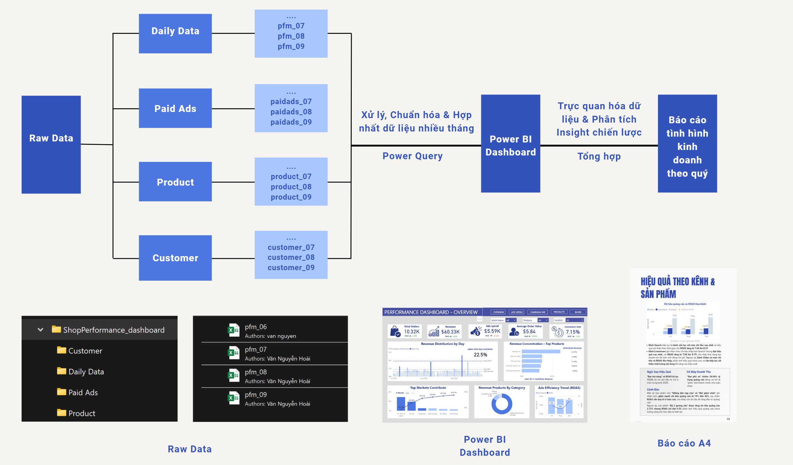
---

## 4. Dashboard phân tích
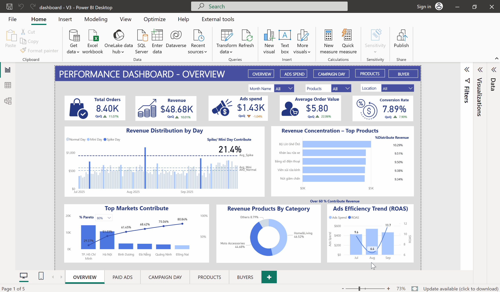

### Các trang chính trong dashboard:
1. **Overview:** Các chỉ số sức khỏe kinh doanh tổng quan của Shop.
2. **Paid Ads:** Phễu chuyển đổi, ROAS theo kênh và chi phí Ads theo từng sản phẩm.
3. **Campaign Day:** Hiệu suất bán hàng trong ngày Spike và Mini Spike.
4. **Product:** Hiệu suất bán hàng của từng sản phẩm theo các kênh.
5. **Buyer:** Tần suất mua, nhóm khách hàng chính và tỷ lệ giữ chân.

  
📊 Xem hình ảnh chi tiết Dashboard

  
  
  
  
  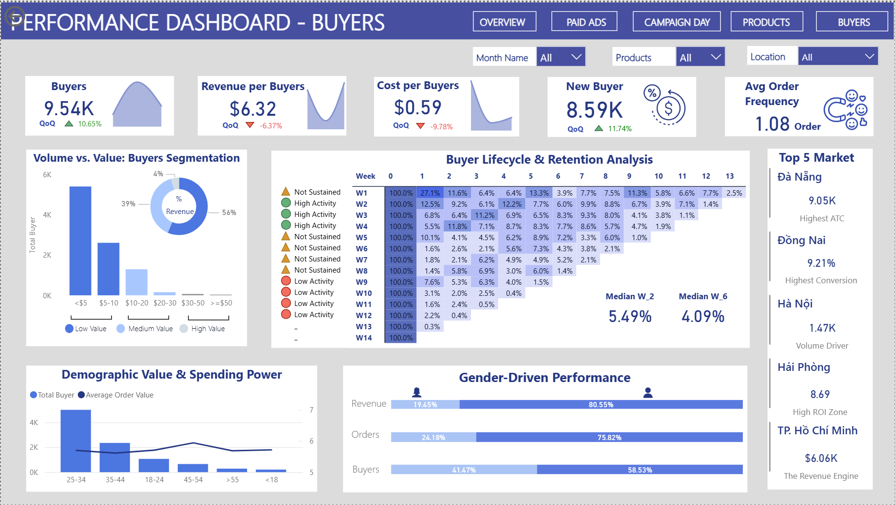

---

## 5. Insight & kế hoạch hành động
Bên cạnh dashboard tương tác, dự án cung cấp báo cáo insight định dạng A4 
phục vụ họp chiến lược và ra quyết định.

**Insight chính:**  
- Tăng trưởng: Doanh thu và giá trị đơn tăng ổn định, tỷ lệ chuyển đổi tốt.
- Quảng cáo: Hiệu quả giảm trước và sau ngày sale; nghẽn ở bước "Thêm vào giỏ".
- Kênh & SP: Livestream hiệu quả nhất; sản phẩm "Bạt che nắng" có ROAS cao.
- Chiến dịch: Spike Day đạt kết quả tốt hơn Mini Spike.
- Khách hàng: Chủ yếu khách mới, tỷ lệ quay lại thấp; Nam giới 25–54 tuổi là tệp khách quan trọng.

**Kế hoạch hành động:**  
- Tăng ngân sách quảng cáo vào ngày Spike Day và Livestream.
- Đẩy mạnh sản phẩm chủ lực tại 3 tỉnh tiềm năng: Đà Nẵng, Hải Phòng, Đồng Nai.
- Tăng tần suất Livestream và tối ưu nội dung Video.
- Kích cầu bằng Voucher và tin nhắn quảng bá trước/sau sale.
- Tập trung tệp khách Nam 25-54 tuổi và triển khai chăm sóc sau mua.

👉 [Xem báo cáo chi tiết](https://www.canva.com/design/DAG9s3TrI1E/cRN25avmiY0nkDxe0fObDw/view?utm_content=DAG9s3TrI1E&utm_campaign=designshare&utm_medium=link2&utm_source=uniquelinks&utlId=h3d8a1d75ec#1)

  
📊 Hình ảnh báo cáo 

 <!-- PAGE BÌA -->

  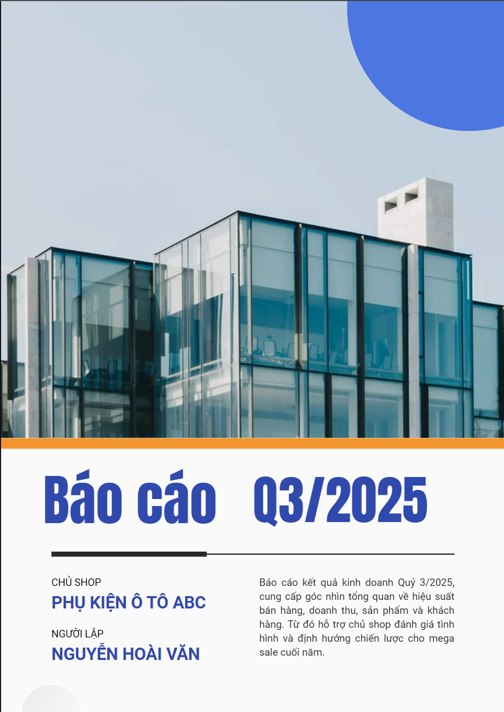

<!-- ROW 1 -->

  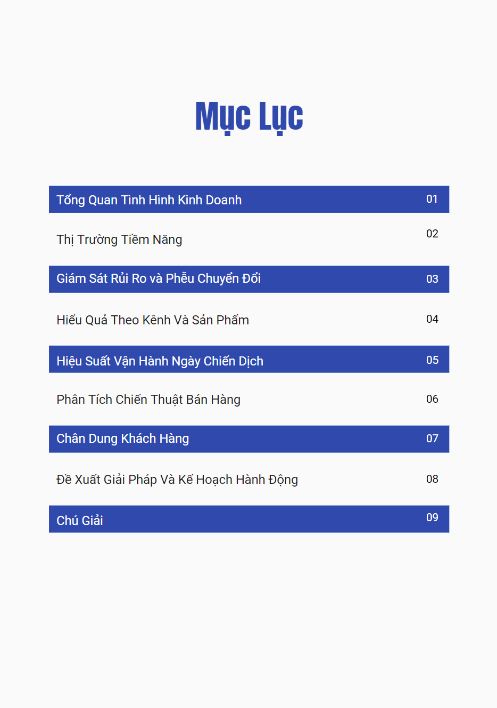
  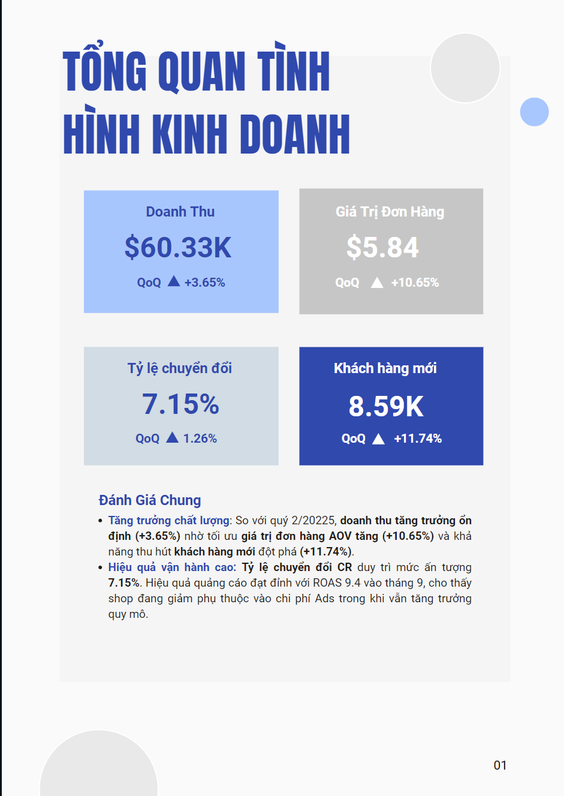
  
  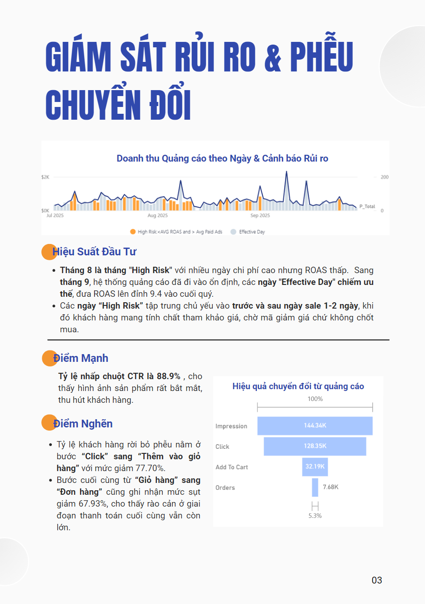

<!-- ROW 2 -->

  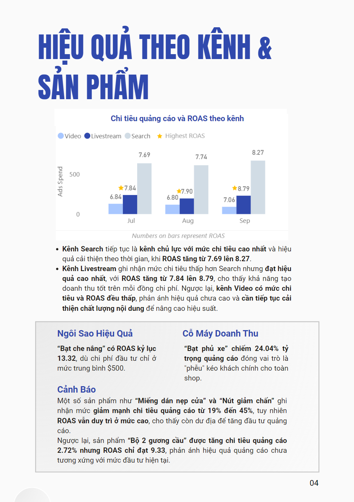
  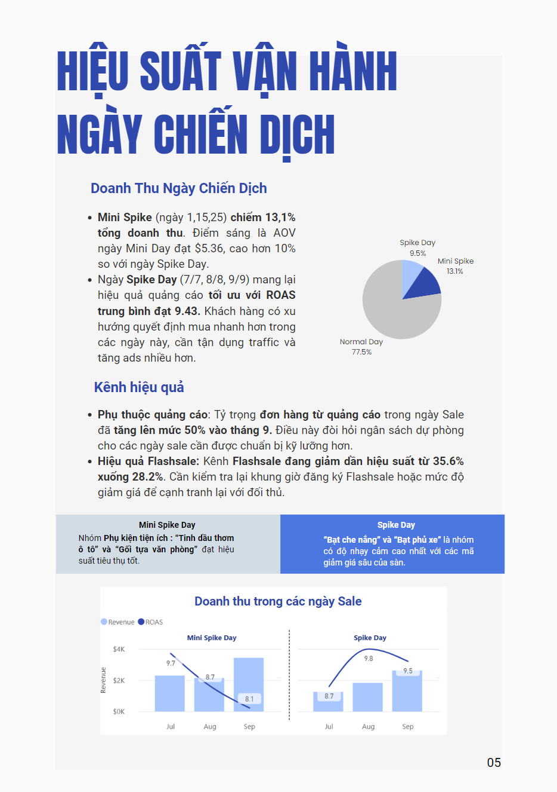
  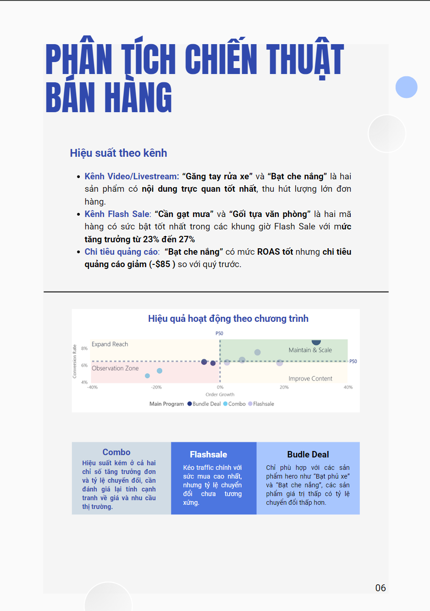
  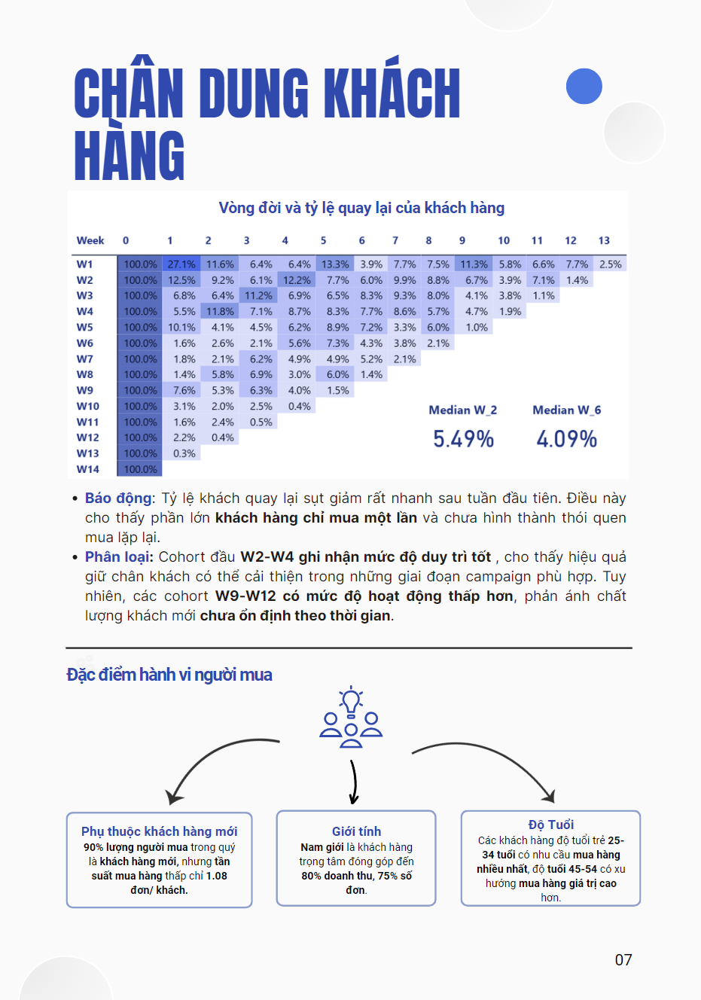

<!-- ROW 3 -->

  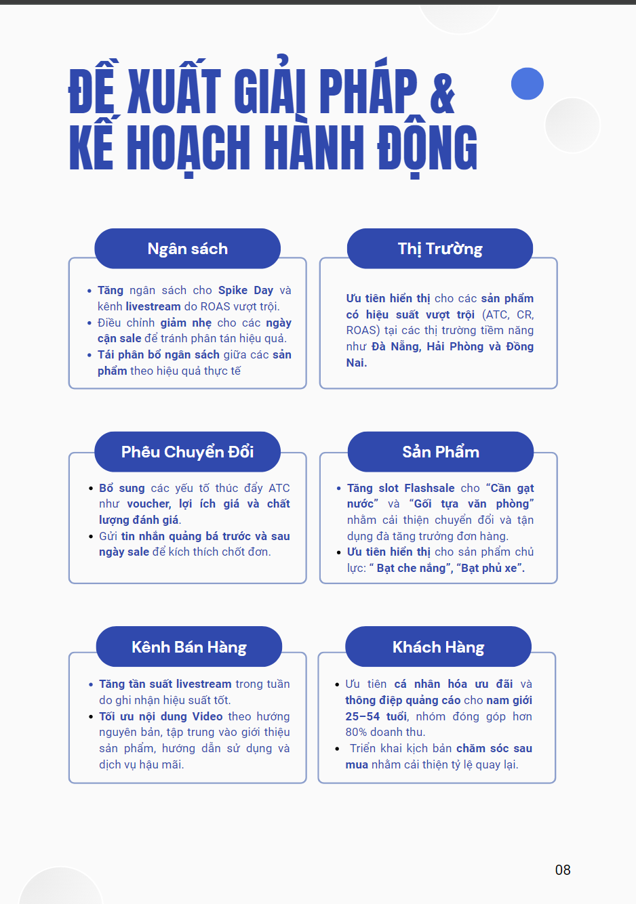
  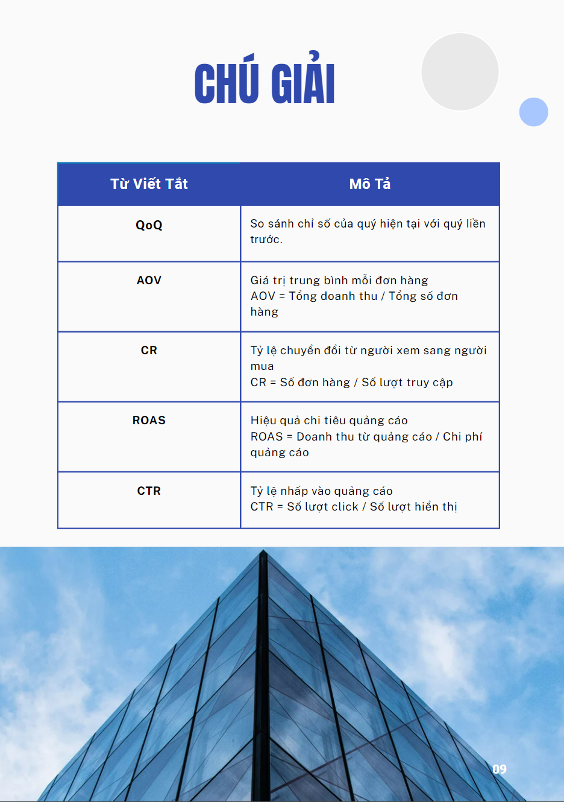

---

## 6. Kết quả đạt được
- Giảm thời gian tổng hợp báo cáo thủ công từ 4 giờ xuống còn dưới 5 phút nhờ cơ chế Parameter động
- Xác định nhóm sản phẩm mang lại ~60% lợi nhuận để ưu tiên đầu tư marketing
