# Phân tích Hiệu quả Kinh doanh Cửa hàng theo Quý

Đọc bằng: [English](README.md) | **Tiếng Việt**

---

## Tổng quan dự án

**Chỉ tăng trưởng doanh thu là chưa đủ để kết luận một cửa hàng đang vận hành tốt.** Một shop có thể tăng doanh số nhưng vẫn làm thất thoát hiệu quả quảng cáo, phụ thuộc quá nhiều vào một vài sản phẩm hoặc kênh bán, đồng thời chưa chuyển đổi được người mua mới thành khách hàng quay lại.

Dự án này xây dựng một **dashboard phân tích hiệu quả kinh doanh theo quý** phục vụ review shop e-commerce, được thiết kế để đánh giá hiệu suất trên các khía cạnh **doanh thu, quảng cáo, chiến dịch, sản phẩm, kênh bán và hành vi khách hàng**.

Bằng việc sử dụng **Power BI**, **Power Query** và **SQL**, tôi xây dựng một quy trình có thể tái sử dụng để hợp nhất các file dữ liệu tháng rời rạc, chuẩn bị logic cohort, và cho phép cùng một cấu trúc dashboard có thể refresh cho **nhiều shop trong cùng một mô hình báo cáo** thông qua **parameter mỗi shop**. Mục tiêu không chỉ là trực quan hóa hiệu suất, mà còn giúp quá trình review kinh doanh định kỳ trở nên nhanh hơn, nhất quán hơn và có tính hành động hơn.

---

## Bộ dữ liệu

Dashboard hợp nhất các file Excel theo tháng trong **một kỳ báo cáo theo quý (Jul–Sep 2025)** thành một mô hình báo cáo có thể tái sử dụng.

Các nhóm dữ liệu nguồn chính bao gồm:

- **Dữ liệu vận hành hằng ngày**
- **Dữ liệu quảng cáo trả phí**
- **Dữ liệu cấp độ sản phẩm**
- **Dữ liệu cấp độ khách hàng**

Các cấp độ phân tích chính bao gồm:

- **cấp độ hiệu suất theo ngày**
- **cấp độ sản phẩm**
- **cấp độ khách hàng**
- **cấp độ ngày chiến dịch**

Mô hình báo cáo được thiết kế để **tái sử dụng cho nhiều shop** thông qua **parameter**, nhờ đó cùng một cấu trúc dashboard có thể được refresh cho các shop khác nhau mà không cần xây lại báo cáo riêng.

---

## Những gì tôi đã xây dựng

- Xây dựng **dashboard Power BI** bao phủ các khía cạnh: sức khỏe kinh doanh, quảng cáo, chiến dịch, sản phẩm và người mua
- Xây dựng **parameter mã shop có thể tái sử dụng** để cùng một cấu trúc dashboard có thể refresh cho nhiều shop khác nhau mà không cần làm lại từng báo cáo
- Sử dụng **Power Query** để gộp các file theo tháng có cùng schema vào một mô hình báo cáo thống nhất
- Sử dụng **SQL** để chuẩn bị **bảng cohort mua đầu tiên** phục vụ trực quan hóa theo hướng retention
- Thiết kế phần **tóm tắt insight** ngắn gọn để phục vụ review kinh doanh và lập kế hoạch hành động

---

## Logic phân tích

Dashboard được tổ chức xoay quanh 5 lăng kính phân tích:

### 1. Sức khỏe kinh doanh
Sử dụng **số đơn hàng, doanh thu, chi tiêu quảng cáo, AOV và tỷ lệ chuyển đổi** để đánh giá liệu tăng trưởng topline có đi kèm với hiệu quả tốt hơn hay không.

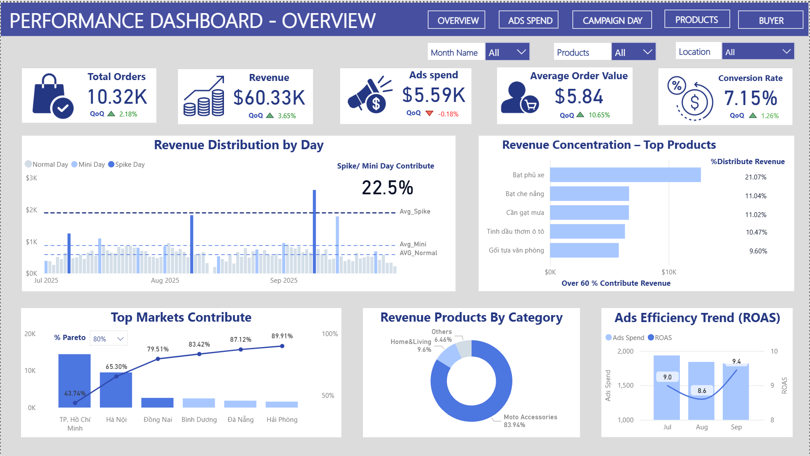

### 2. Hiệu quả quảng cáo
Sử dụng **ROAS, chi phí trên mỗi đơn hàng, mức suy giảm theo từng bước của phễu chuyển đổi và mức đóng góp quảng cáo theo sản phẩm** để xác định phần nào của ngân sách quảng cáo đang chuyển đổi tốt và phần nào đang bị thất thoát.

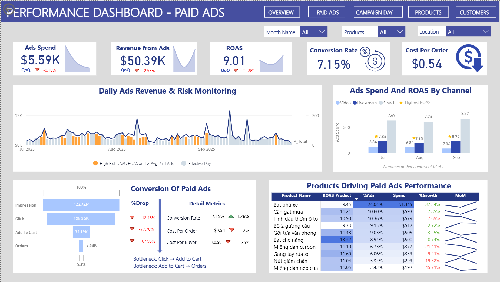

### 3. Hiệu quả chiến dịch
So sánh **Mini Spike và Spike Day** dựa trên **đơn hàng, doanh thu, chi tiêu quảng cáo, AOV và ROAS** để đánh giá khung chiến dịch nào mang lại hiệu quả cao hơn.

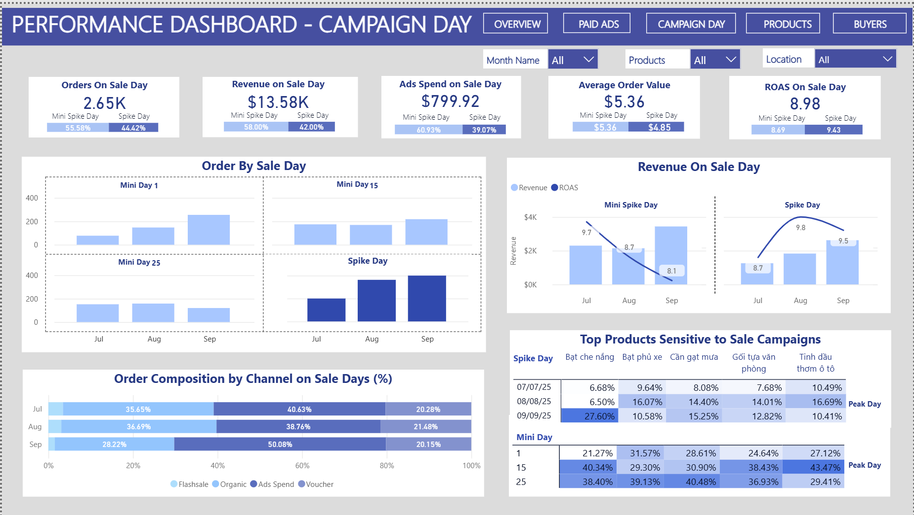

### 4. Đóng góp của sản phẩm và kênh
Đo lường **mức độ tập trung doanh thu, ROAS theo sản phẩm và cơ cấu kênh** nhằm xác định các **tổ hợp sản phẩm - kênh mang lại hiệu quả cao nhất**.

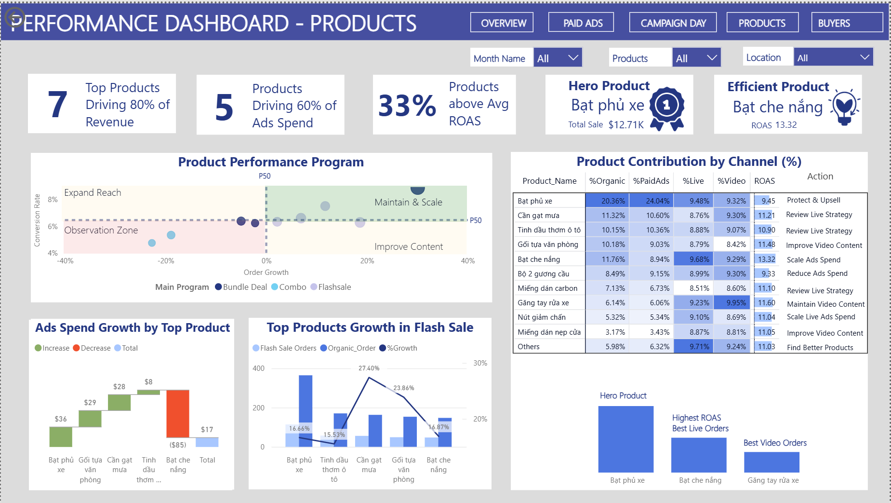

### 5. Mô hình giữ chân khách hàng
Sử dụng **tăng trưởng người mua, tần suất mua hàng và retention theo cohort** để đánh giá liệu tăng trưởng chủ yếu đến từ **thu hút người mua mới** hay được hỗ trợ bởi **hành vi mua lại**.

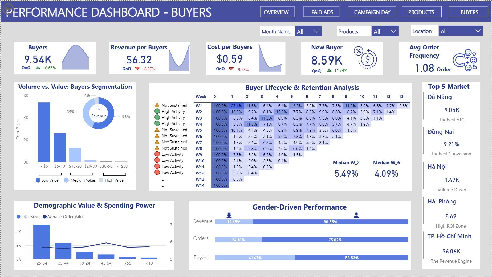

---

## Logic chuẩn bị dữ liệu

Một thách thức lớn của dự án này là biến các file dữ liệu tháng rời rạc thành một mô hình có thể hỗ trợ review kinh doanh định kỳ.

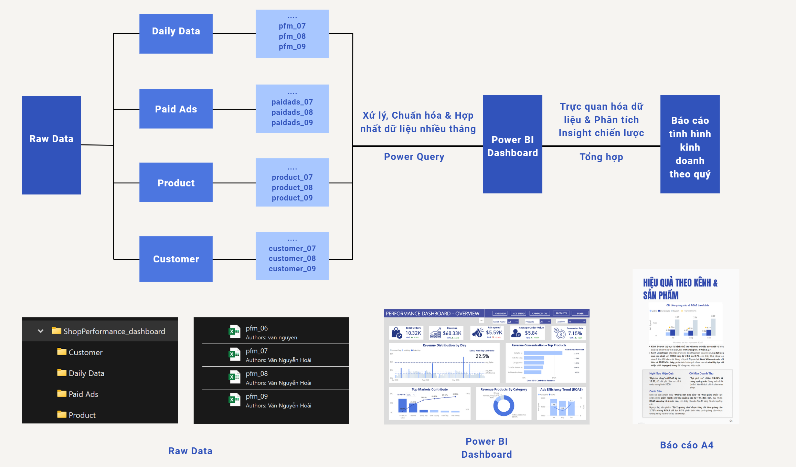

### Power Query
Tôi sử dụng **Power Query (M)** để:

- gộp file qua nhiều tháng
- căn chỉnh các bộ dữ liệu có cùng cấu trúc
- chuẩn hóa định dạng cột
- loại bỏ các dòng dữ liệu không hợp lệ
- tạo một lớp dữ liệu báo cáo thống nhất có thể tái sử dụng giữa các chức năng

Điều này cho phép kết hợp các file tháng rời rạc vào cùng một mô hình dashboard, thay vì phải duy trì các file riêng cho từng tháng hoặc từng mảng chức năng.

### Thiết kế parameter động
Tôi xây dựng **parameter mã shop** để cùng một dashboard có thể tái sử dụng cho nhiều shop.

Thay vì phải xây lại báo cáo riêng hoặc thay file nguồn thủ công, người dùng chỉ cần thay đổi mã shop một lần rồi refresh toàn bộ dataset trong cùng một cấu trúc phân tích. Cách làm này biến dashboard từ một báo cáo dùng một lần thành một **mẫu báo cáo có khả năng mở rộng**.

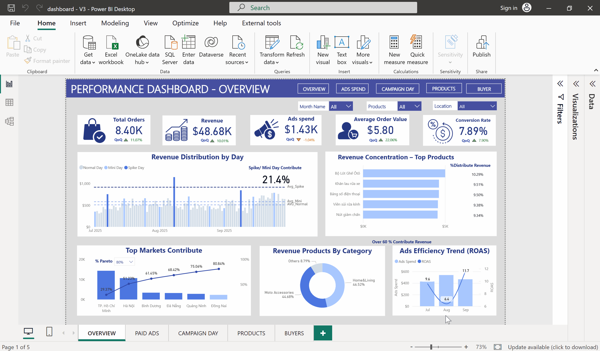

### SQL cho phân tích cohort

Tôi sử dụng **SQL** để chuẩn bị **bảng cohort mua đầu tiên** phục vụ trực quan hóa theo hướng retention, giúp theo dõi hành vi mua lại theo thời gian dễ hơn thay vì chỉ nhìn vào số lượng người mua tổng hợp. [SQL_Cohort](sql/cohort_analysis)

---

## Các phát hiện chính

- Trong quý, shop ghi nhận **10,32K đơn hàng**, **60,33K USD doanh thu** và **tỷ lệ chuyển đổi 7,15%**, trong khi **AOV đạt 5,84 USD**. Doanh thu tăng **+3,65% QoQ**, trong khi chi tiêu quảng cáo gần như đi ngang ở mức **5,59K USD (-0,18%)**, cho thấy tăng trưởng tổng thể được cải thiện mà không đi kèm mức tăng tương ứng ở ngân sách quảng cáo.

- Hiệu quả quảng cáo chưa đồng đều. Dù **ROAS đạt 9,01**, điểm rơi lớn nhất của phễu nằm ở bước **Click → Add to Cart (-77,70%)**, cho thấy ưu tiên chính nên là cải thiện khả năng chuyển đổi ở phần sâu của phễu thay vì chỉ tiếp tục đẩy thêm traffic.

- **Livestream** là kênh quảng cáo trả phí có hiệu quả tốt nhất, với ROAS tăng từ **7,84** trong tháng 7 lên **8,79** trong tháng 9. Ở cấp độ sản phẩm, **Sunshade Cover** đạt **ROAS cao nhất là 13,32**, qua đó trở thành tổ hợp kênh - sản phẩm rõ ràng nhất để tiếp tục mở rộng.

- **Spike Day** vượt **Mini Spike** về hiệu quả với **ROAS 9,43 so với 8,69**, dù chỉ chiếm tỷ trọng ngân sách quảng cáo thấp hơn (**39,07% so với 60,93%**), cho thấy ngân sách nên được tập trung mạnh hơn vào Spike Day.

- Tăng trưởng vẫn chủ yếu đến từ việc thu hút khách hàng mới. Trong tổng số **9,54K người mua**, có **8,59K là người mua mới**, trong khi **tần suất mua hàng trung bình chỉ đạt 1,08** và **retention cohort trung vị** giảm từ **5,49% (tuần 2)** xuống **4,09% (tuần 6)**, cho thấy cần tăng cường hơn nữa các hoạt động giữ chân sau mua.
  
---

👉 [Xem báo cáo mẫu chi tiết](https://www.canva.com/design/DAG9s3TrI1E/cRN25avmiY0nkDxe0fObDw/view?utm_content=DAG9s3TrI1E&utm_campaign=designshare&utm_medium=link2&utm_source=uniquelinks&utlId=h3d8a1d75ec#1)

  
📊 Hình ảnh báo cáo 

 <!-- PAGE BÌA -->

  

<!-- ROW 1 -->

  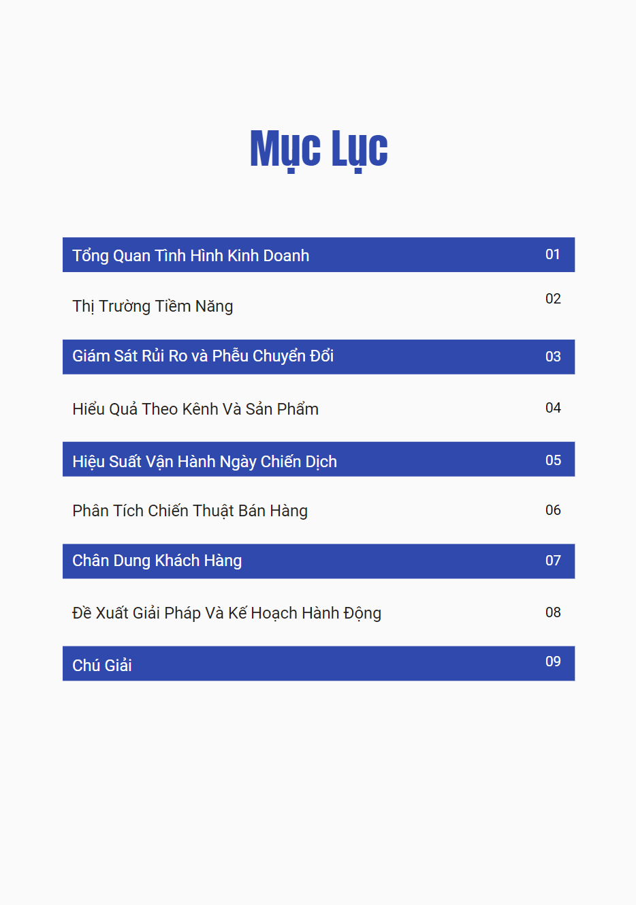
  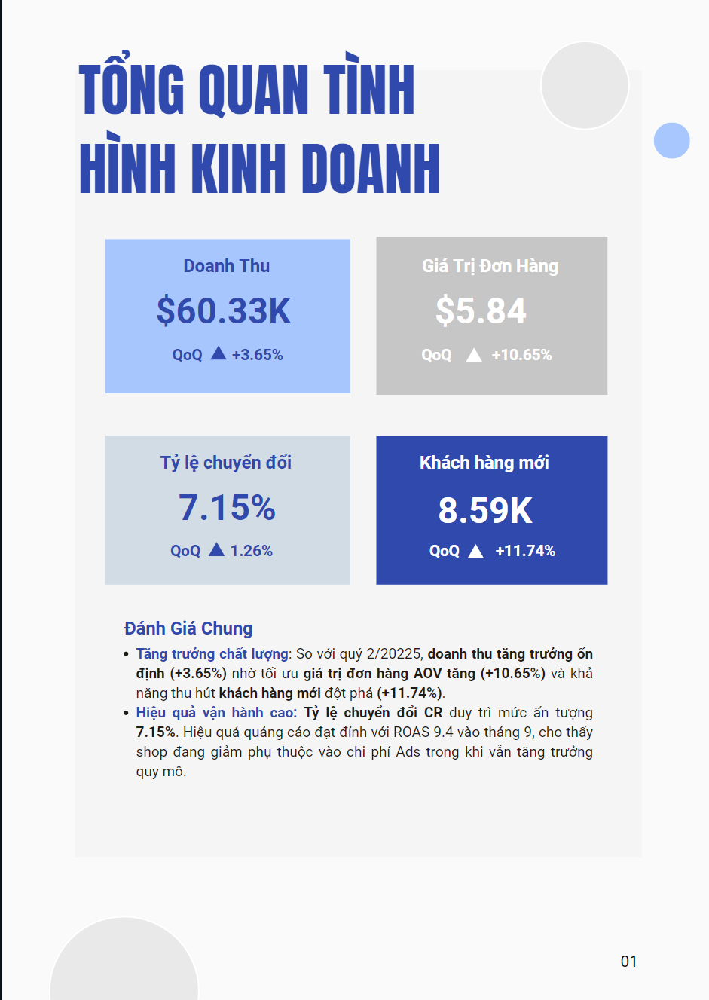
  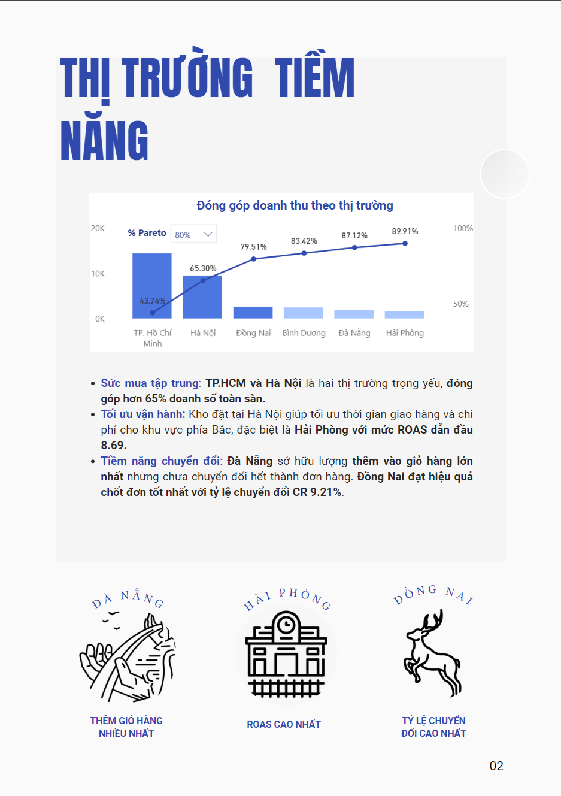
  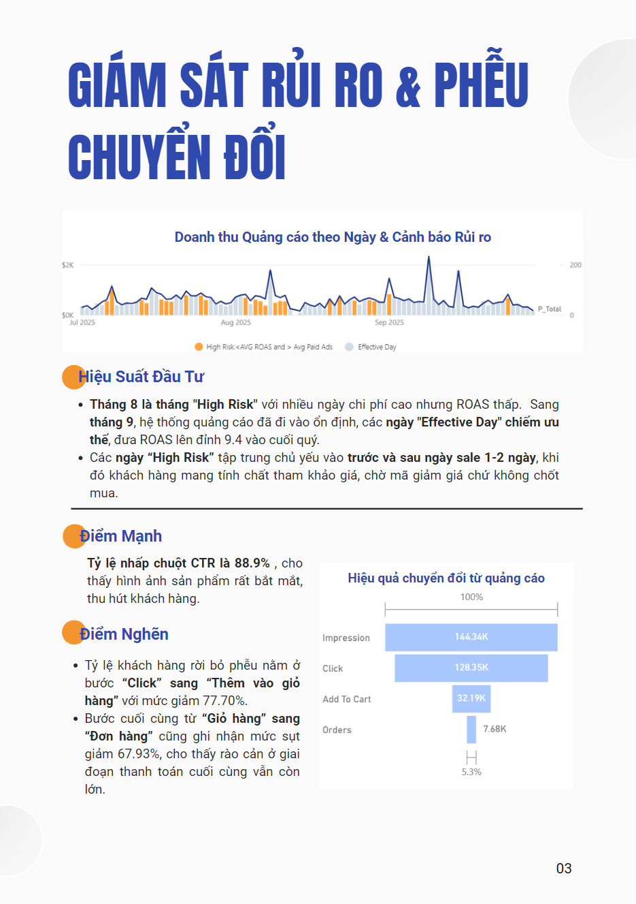

<!-- ROW 2 -->

  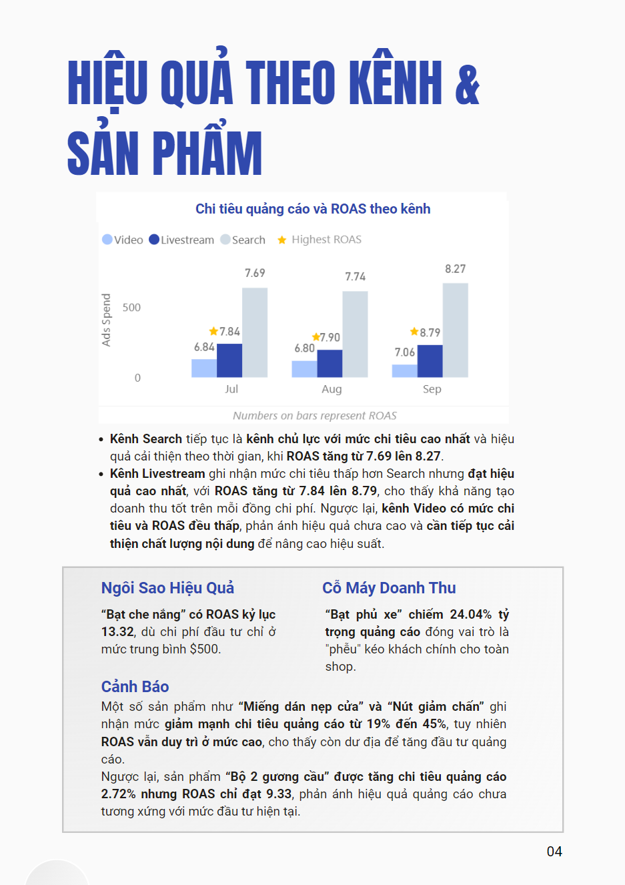
  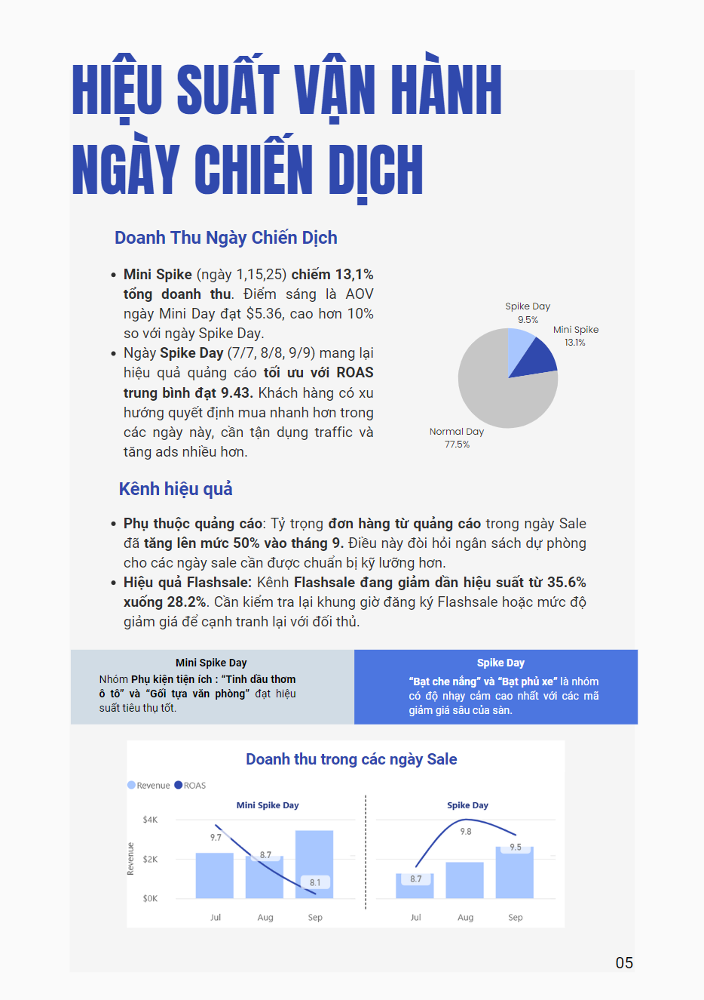
  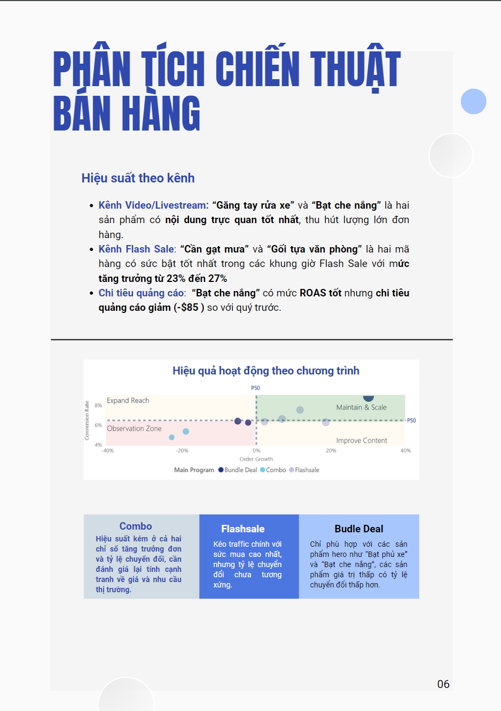
  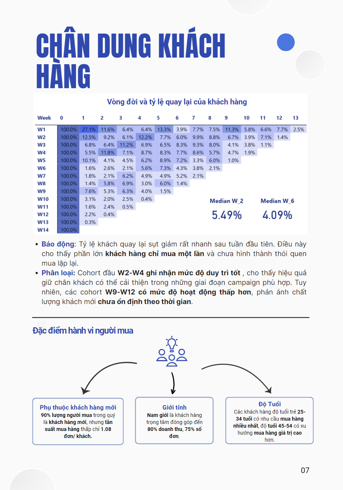

<!-- ROW 3 -->

  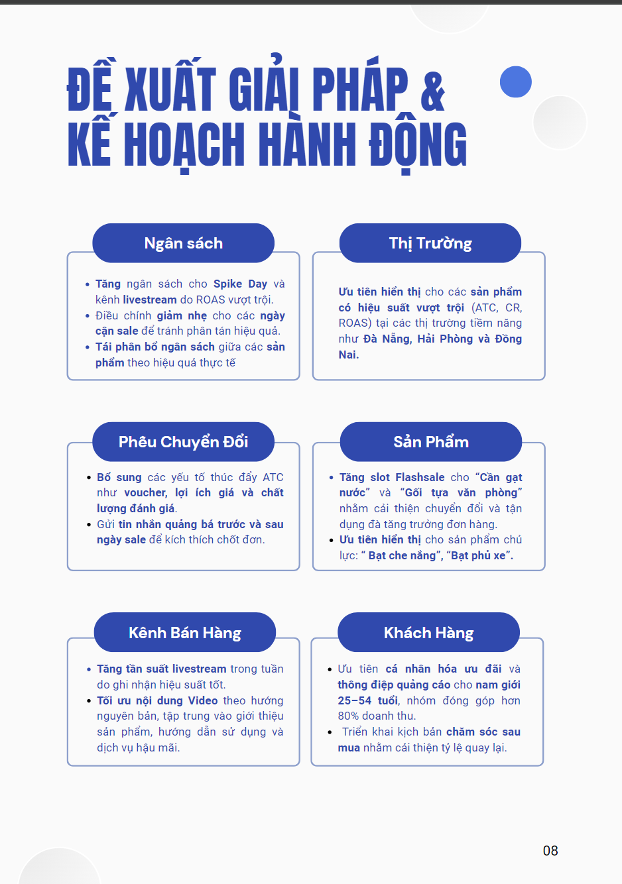
  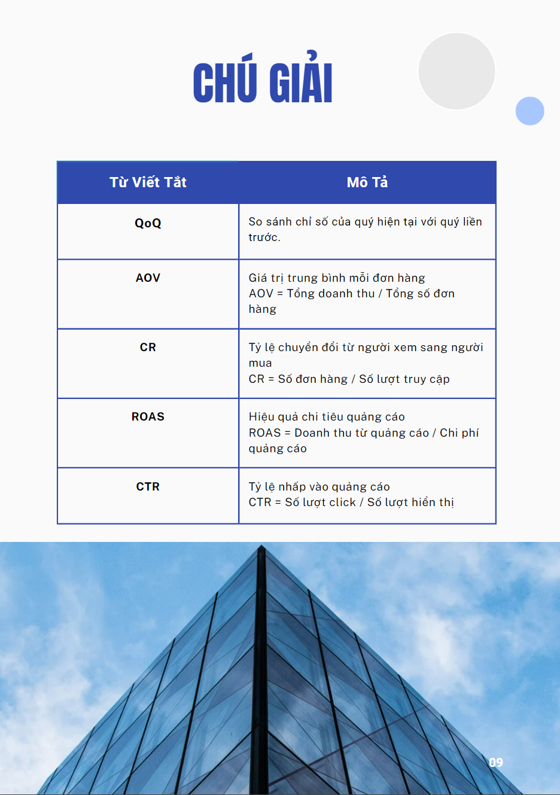

---

## Phạm vi và hạn chế

Dự án này được thiết kế cho mục tiêu **phân tích kinh doanh và review hiệu suất định kỳ**, không nhằm phục vụ dự báo hay kiểm định quan hệ nhân quả.

Điểm mạnh của dự án nằm ở khả năng xác định **mẫu hình vận động, điểm nghẽn, rủi ro tập trung và ưu tiên hành động** từ dữ liệu quý về shop, quảng cáo, sản phẩm và khách hàng. Phân tích cohort được đưa vào để hỗ trợ đọc hành vi mua lại, nhưng các kết luận về retention dài hạn vẫn bị giới hạn bởi độ dài của cửa sổ dữ liệu lịch sử hiện có.

---

## Đầu ra bàn giao

- **Dashboard Power BI** gồm 5 trang phân tích
- **Thiết lập parameter động** để refresh cho nhiều shop
- **Logic cohort bằng SQL** để trực quan hóa hành vi mua lại
- **Báo cáo tóm tắt insight** phục vụ review kinh doanh

---

## Kết quả

- Giảm thời gian làm báo cáo thủ công từ **~4 giờ xuống dưới 10 phút** nhờ cơ chế parameter động
- Xây dựng cấu trúc báo cáo có thể tái sử dụng và refresh cho **nhiều shop** mà không cần xây lại dashboard riêng
- Xác định một nhóm sản phẩm đóng góp khoảng **60% tổng lợi nhuận**, qua đó hỗ trợ tập trung đầu tư marketing hiệu quả hơn
